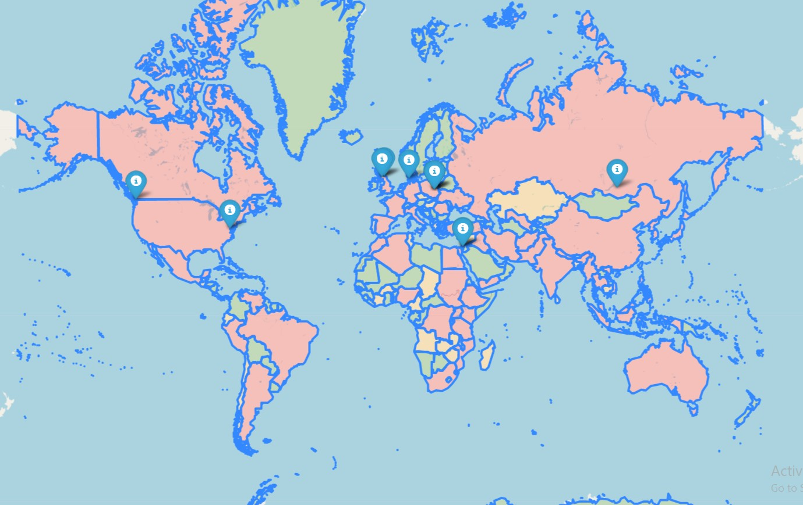

# map_generator
(Laboratory 2.2)
map_generator is a module to generate a custom map.

## Information map providing, conclusion
The map consists of 3 layers: main layer(map itself), the closest locations (10 max) to
coordinates (which user entered) where films were made, and color marking regarding population.
Conclusion: there is a possibility in obsering pattern between country's population and
probability the location being the one where film made.

## Example Usage:
```bash
$ python main.py
Please enter a year you would like to have a map for: 2015
Please enter your location (format: lat, long): 49.83826, 24.02324
Map is generating...
Please wait...
Finished. Please have look at the map 2000_movies_map.html
```
The result:


## HTML description
head, body - basic tags

link - tag to link css files

script - tag to execute js code

meta - tag to define metadata
